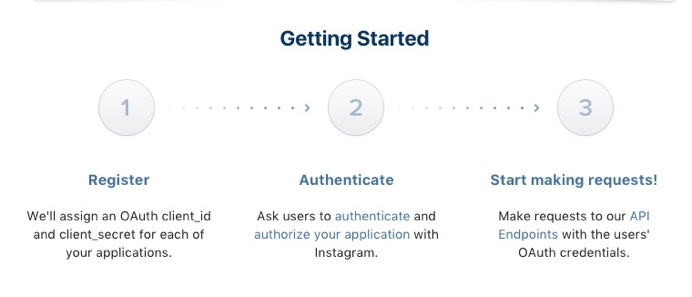
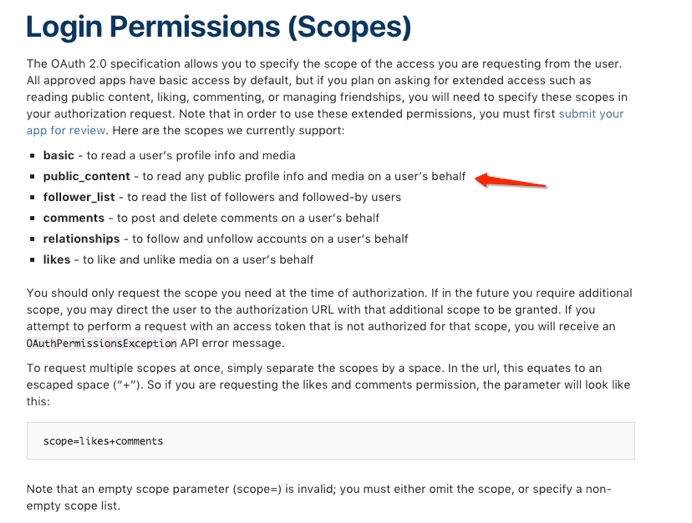
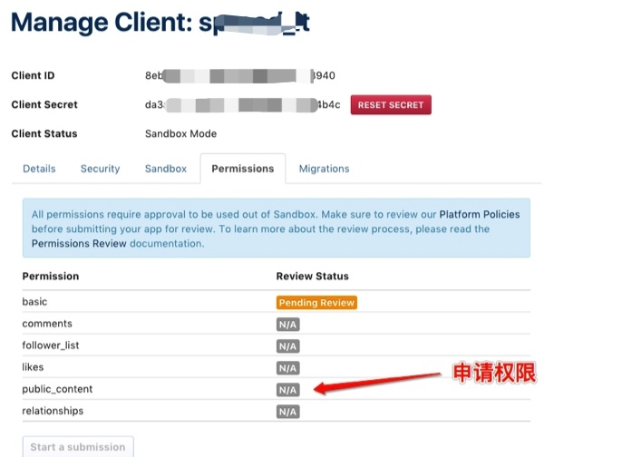
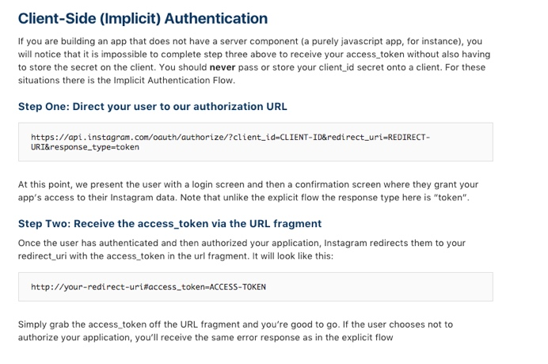
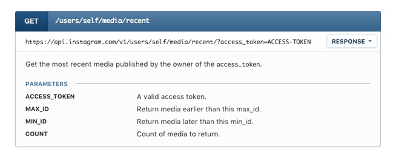
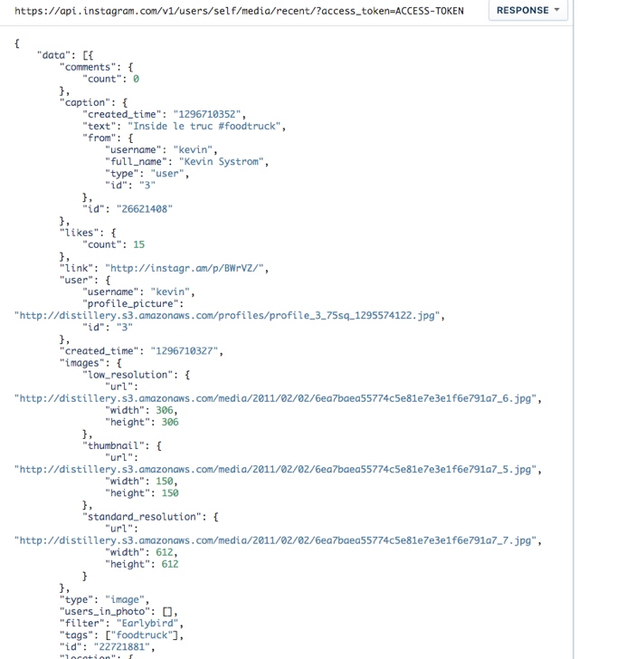
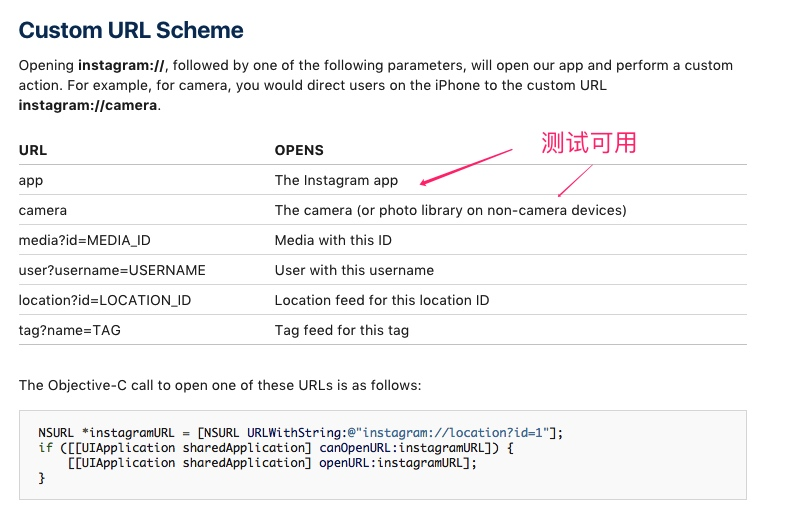
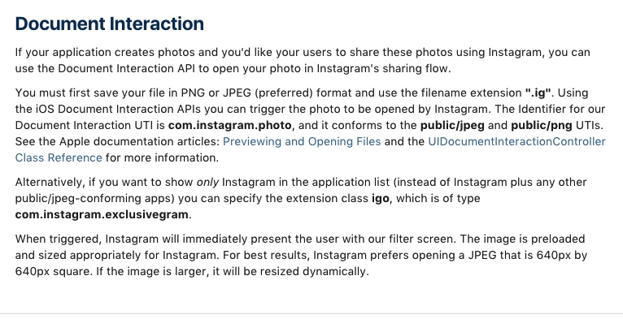

# Instagram 分享
share to instagram by Custom URL Scheme or Document Interaction
SpreadIt：编写whatsApp Demo完成80%


分享：无需获取权限，通过Custom URL Scheme或者Document Interaction
分享出去后停留在Instagram，无回调（返回值）。

另外：通过授权（账号和密码）的方式，可以获取用户的公开内容。

登陆权限有如下几种：
 

获取较高权限，比如：public_content可以拿到用户发布的图片和视频内容。
备注：
客服端申请权限，目前只申请下来basic权限，public_content权限没申请下来，没能继续测试是否能拿到用户发布的内容，但是理论上是可以的，且看下面的介绍）


根据官方文档的介绍：
第一步：授权，获取access_token;

 
第二步：get用户最新发布的media。
 

请求的url及参数如上图所示，返回的结果如下图所示。
 


结论：可以先请求用户授权，然后分享照片，最后获取最新发布的信息。

分享文档：https://www.instagram.com/developer/mobile-sharing/iphone-hooks/

通过 URL Scheme 分享，截图如下：


```
-(void)loadInstagram;

```

通过UIDocumentInteractionController,原文档说明如下：

示例代码：

```
-(void)shareToInstagramByDocumentImage:(NSString *)imageStr;

```


```
-(void)shareToInstagramByImage:(NSString *)imageStr

```

```
-(void)shareToInstagramByDocumentnNameWith:(NSString *)imageName;

```


